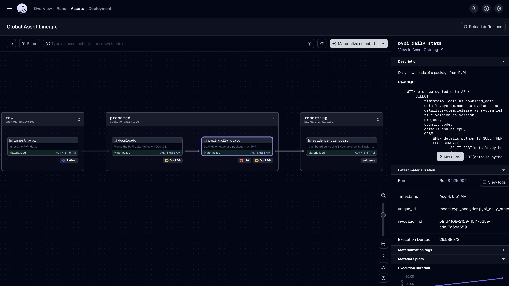

# package_analytics

This stack is built with a combination of tools including:

- [Google BigQuery](https://cloud.google.com/bigquery?hl=en) (data source)
- [Dagster](https://dagster.io) (orchestration)
- [DuckDB](https://duckdb.org) (database and query engine)
- [MotherDuck](https://motherduck.com) (cloud service for DuckDB)
- [dbt](https://www.getdbt.com) (transformation)
- [Evidence](https://evidence.dev) (dashboard framework)




## Source
This project queries the public PyPI Packages ~360TB dataset of ~1,020,000,000,000 rows.


### Requirements
- `cp .env.template .env` and fill with the following variables:

```
# optionally set to an existing directory to persist dagster-webserver data
#DAGSTER_HOME=/tmp/dagster

GCP_PROJECT=your-gcp-project-to-access-bigquery-pypi-dataset
GOOGLE_APPLICATION_CREDENTIALS=/path/to/gcp/credentials (typically in ~user/.config/gcloud/)

# DUCKDB_DATABASE is used as an ingestion destination and source for Evidence Dashboard
# local duckdb database can only be used by Evidence if located in the dashboard sources folder
DUCKDB_DATABASE=../dashboard/sources/pypi_analytics/pypi_analytics.duckdb
EVIDENCE_SOURCE__pypi_analytics__filename=pypi_analytics.duckdb

# switch to a remote MotherDuck database
#MOTHERDUCK_TOKEN=
#DUCKDB_DATABASE=md:pypi_analytics?motherduck_token=${MOTHERDUCK_TOKEN}
#EVIDENCE_SOURCE__pypi_analytics__filename=${DUCKDB_DATABASE}


# parameters used to query the PyPI dataset
START_DATE=2024-08-05
END_DATE=2024-08-06
PYPI_PROJECT=duckdb, ibis-framework, polars, trino, clickhouse-connect
TIMESTAMP_COLUMN=timestamp
TABLE_NAME=downloads
```


### Dagster

From a virtual environment, run

```bash
pip install -e ".[dev]"
```

Then, start the Dagster UI web server:

```bash
dagster dev
```

Open http://localhost:3000 with your browser to see the project, click Materialize all to run the end-to-end pipeline.


### Evidence

For Evidence.dev, you will need [Node v20](https://nodejs.org/en/download) installed.

Materialize the assets via Dagster or build Evidence manually from the dashboard folder (after ingesting to a local DuckDB or remote MotherDuck database) via:

```bash
npm install
npm run build
npm run sources
```

Run the Evidence visualisation locally:

```bash
npm run dev
```
